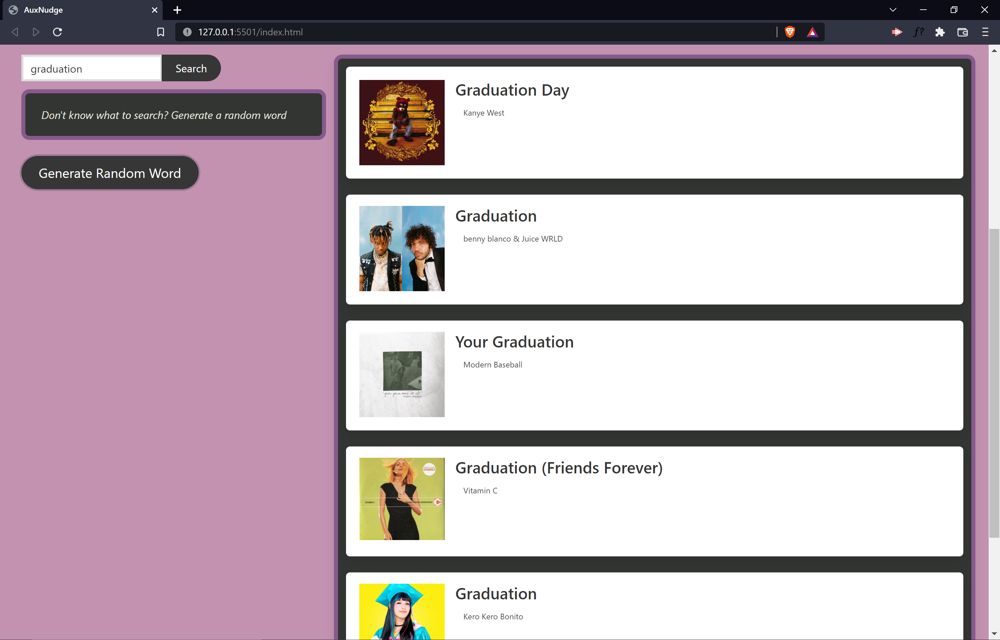

# **AuxNudge**
Song search based on user input/random word generator

## License

## Authors

Zachary Warnes - [github](https://github.com/ZacharyWarnes) - zacharywarnes@gmail.com  
Alex Mayberry - [github](https://github.com/alexmayberry) - alexclimbs@gmail.com  
Cheryl Caitano - [github](https://github.com/ccaitano) - cheryl.caitano@gmail.com  
Junghan Seo - [github](https://github.com/junghan84) - Junghanseo84@gmail.com  
Andrew Cha - [github](https://github.com/Jinnywoo) - jinwoo2639@gmail.com  

## [Deployed Page](https://ccaitano.github.io/aux-nudge/)

## [GitHub Repo](https://github.com/ccaitano/aux-nudge)

## Video Walkthrough

Client side functionality walk-through in live app.
  [Our walkthrough URL](#)

## Project Description

A web application that allows the user to search for songs based on a keyword or phrase either input by the user or from a random word generator. The keyword can either appear in the song title, artist name, album name, or lyrics of the song itself.

## Technology Used

**jQuery:** A fast, small, and feature-rich JavaScript library.  
**Bulma:** A free, open source framework that provides ready-to-use frontend components that you can easily combine to build responsive web interfaces  
**Words API** - An API for the English Language that finds definitions, related words, and more.  
**Genius Lyrics API** - An API that searches genius.com (a pop music wiki) for song information such as track titles, artist names, album names, links to lyrics, etc.  

 

## Landing Page

 

## *Example:* Nostalgic Graduation Playlist

 

### Search Results

 

### More Info Modal

 

### Youtube Search Link

 

### Saved Tracks List

 

## Random Word Button Example

 

### Random Word Search Results

 

*Thank you for reading our readme. Please reachout if you have any questions.*
